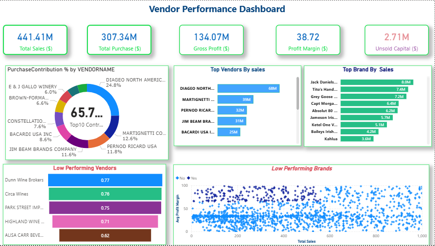

<h1>🧾 Vendor Performance Analysis – Retail Inventory & Sales</h1>

<i>Analyzing vendor efficiency and profitability to support strategic purchasing and inventory decisions using SQL, Python, and Power BI.</i>

<h2 id="overview">Overview</h2>

This project evaluates vendor performance and retail inventory dynamics to generate actionable insights for purchasing, pricing, and inventory optimization.
A complete data pipeline was built using SQL for ETL, Python for analysis and hypothesis testing, and Power BI for visualization.

<h2 id="business-problem">Business Problem</h2>
<ul>
<li>Identify underperforming brands needing pricing or promotional adjustments</li>
<li>Determine vendor contributions to sales and profits</li>
<li>Analyze the cost-benefit of bulk purchasing</li>
<li>Investigate inventory turnover inefficiencies</li>
<li>Statistically validate differences in vendor profitability</li>
</ul>

<h2 id="dataset">Dataset</h2>
<ul>
<li>Multiple CSV files located in <code>/data/</code> folder</li>
<li>Summary table created from ingested data and used for analysis</li>
</ul>

<h2 id="tools">Tools & Technologies</h2>
<ul>
<li>SQL (CTEs, Joins, Filtering)</li>
<li>Python (Pandas, Matplotlib, Seaborn, SciPy)</li>
<li>Power BI (Interactive Visualizations)</li>
<li>GitHub</li>
</ul>

<h2 id="project-structure">Project Structure</h2>
<pre>
vendor-performance-analysis/
│
├── README.md
├── Vendor Performance Report.pdf
│
├── notebooks/
├── scripts/
├── dashboard/
</pre>

<h2 id="data-cleaning">Data Cleaning & Preparation</h2>
<ul>
<li>Removed transactions with negative or zero profit and sales</li>
<li>Created vendor-level summary tables</li>
<li>Handled missing values and outliers</li>
</ul>

<h2 id="eda">Exploratory Data Analysis (EDA)</h2>
<ul>
<li>Detected loss-making transactions and zero margins</li>
<li>Identified outliers in freight and pricing</li>
<li>Strong correlation between purchase and sales quantity</li>
<li>Weak relationship between pricing and profitability</li>
</ul>

<h2 id="findings">Key Findings</h2>
<ul>
<li>Top 10 vendors contribute ~65.7% of total purchases</li>
<li>Bulk purchasing reduces cost significantly (~72%)</li>
<li>$2.71M unsold inventory identified</li>
<li>Statistically significant differences in vendor profitability</li>
</ul>

<h2 id="dashboard">Dashboard</h2>

Power BI dashboard showing vendor performance, inventory turnover, and profitability insights.

<h2 id="recommendations">Final Recommendations</h2>
<ul>
<li>Diversify vendor base to reduce dependency risk</li>
<li>Optimize bulk purchasing strategies</li>
<li>Adjust pricing for slow-moving inventory</li>
<li>Improve marketing for underperforming vendors</li>
</ul>

<h2 id="contact">Author & Contact</h2>

<b>Pavan</b> 
Data Analyst 
📧 Email: psillal4321@gmail.com 
🔗 <a href="https://www.linkedin.com/in/pavan-479173238">LinkedIn Profile</a>

